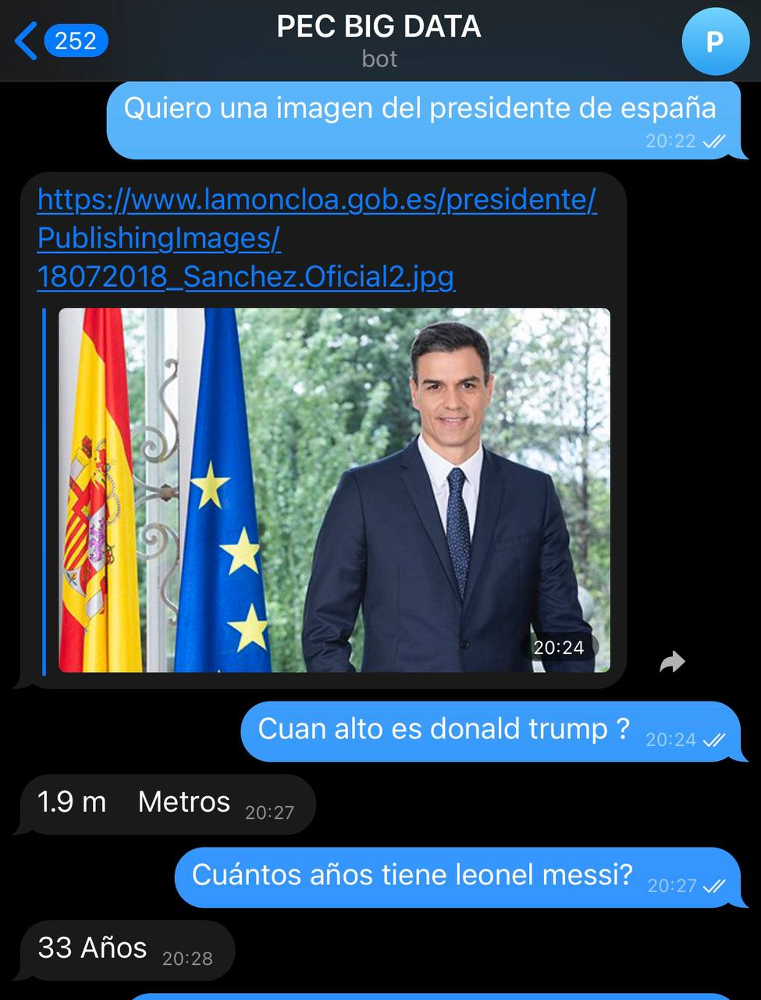

# BotTelegram

Telegram Bot using WIT.AI to detect sentiment and custom APIs for WIT, GOOGLE and Telegram. (All made by me, still on very early alpha versions, only the neccesary functionalities available

The bot is able to detect to answer to questions about age, height or the request of photographies. 
Photos are scraped from google images while the questions are passed to google and the result is scrapped. 
We use the request library for this functionality.

